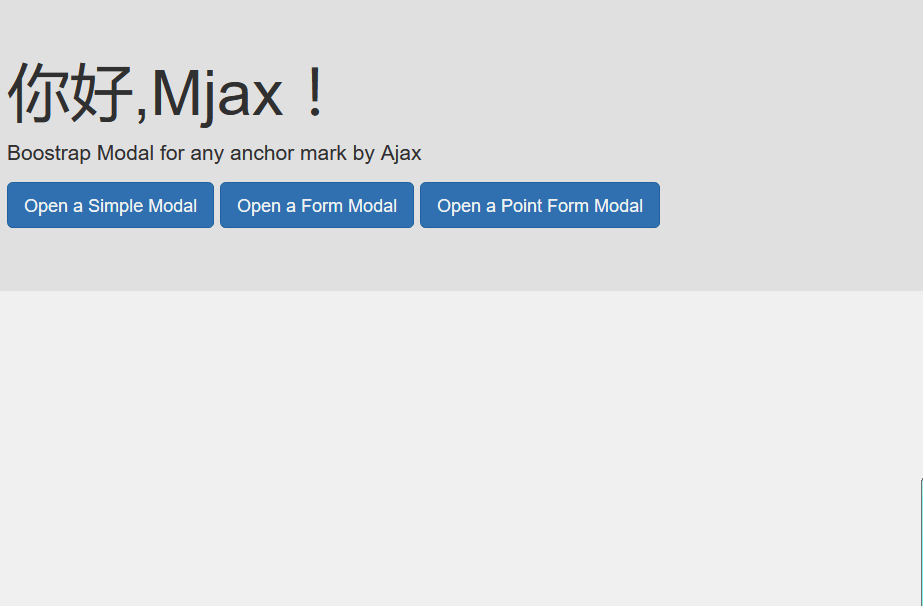

# jquery.mjax

Bootstrap Modal for any anchor mark by Ajax



> NOTE

add new httpcode 309 (X-Mjax-Redirect)  to redirect by self, need replace 302 to 309 by server

[yii2-mjax](https://github.com/dungang/yii2-mjax)

> Open a simple Boostrap Modal

add a class `mjax` to <a>

```
<a class="btn btn-primary btn-lg mjax" href="content.html" role="button">Open a Simple Modal</a>
```

> open a form Boostrap Modal

yes! add a class `mjax` to <a> too!

```
<a class="btn btn-primary btn-lg mjax" href="form.html" role="button">Open a Form Modal</a>
```

> open a point form Boostrap Modal

what's a point form ?

like this, a registed submit event form

```
<form id="point-form" action="form-result.html" method="post">
  <div class="form-group">
    <label for="exampleInputEmail1">Email address</label>
    <input type="email" class="form-control" id="exampleInputEmail1" placeholder="Email">
  </div>
  <div class="form-group">
    <label for="exampleInputPassword1">Password</label>
    <input type="password" class="form-control" id="exampleInputPassword1" placeholder="Password">
  </div>
  <div class="form-group">
    <label for="exampleInputFile">File input</label>
    <input type="file" id="exampleInputFile">
    <p class="help-block">Example block-level help text here.</p>
  </div>
  <div class="checkbox">
    <label>
      <input type="checkbox"> Check me out
    </label>
  </div>
  <button type="submit" class="btn btn-default">Submit</button>
</form>
<script>
    $(document).ready(function(){
        alert("It's a point form!");
        $('#point-form')
            .attr('anyattr','ddd')
            // here register a submit event, so we call point form
            .on('submit',function(event){

            alert('1) reveive point-form submit event');
            console.log('1) receive point-form submit event:');
            console.log(event);

            // if has a point ,so we can do something to interrupt
            var newEvent = $.Event('beforeSubmit')
            alert('2) trigger beforeSubmit event');

            console.log('2) trigger beforeSubmit event:');
            console.log(newEvent);
            $(this).trigger(newEvent);
            alert('3) triggered beforeSubmit event');
            console.log('3) triggered beforeSubmit event:');
            console.log (newEvent.result)
            console.log(newEvent);
            alert('4) end');
            return newEvent.result;
        });
    });
</script>
```
how we do ?

 -  add `data-point-form` and `data-point-event` to the form

like this

```
<form 
id="point-form" 

data-point-form="true" 
data-point-event="beforSubmit" 

action="form-result.html" method="post">

```

- pass init options

all form is a point form

```
$('a.mjax').mjax({
    pointFrom:true,
    pointEvent:'beforSubmit'
});

```

or 

if a form has a special attribute, or anything

```
$('a.mjax').mjax({
    pointForm:function(){ 
        //tell mjax,this is a point form 
        //do anything ,return true is a point form , false is not
        // this -> form
        return typeof(this.attr("anyattr"))!="undefined";
    },
    pointEvent: 'beforeSubmit'
});

```

> php packager

[yii2-mjax](https://github.com/dungang/yii2-mjax)